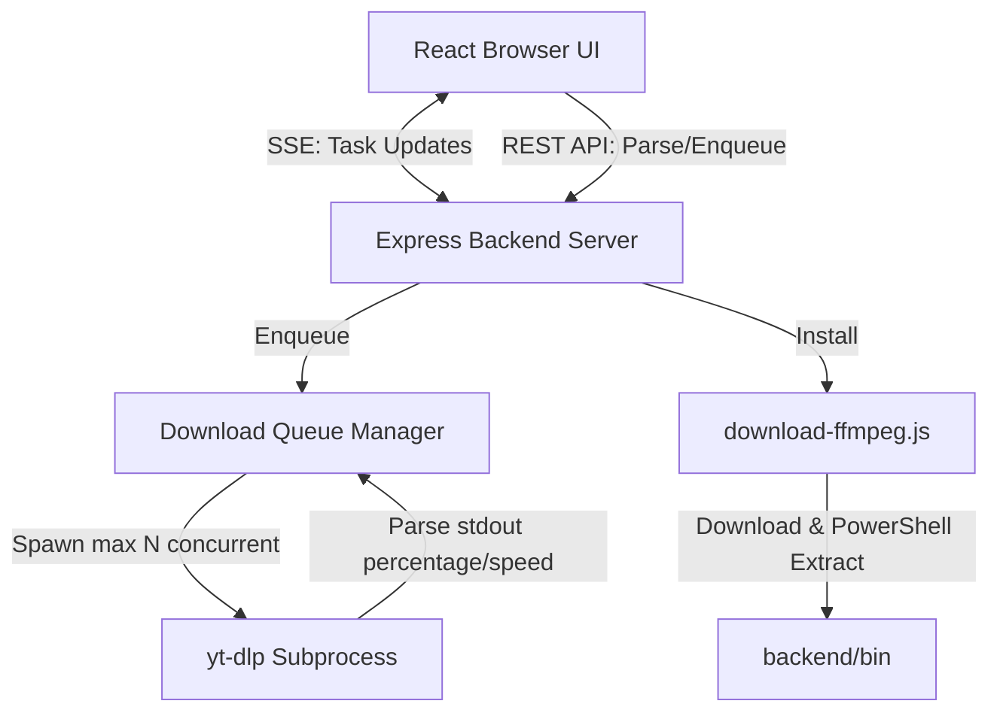

# Social Media Video Downloader

A modern, local web application designed to parse and download video and audio content from various social media platforms (including YouTube, TikTok, Instagram, Twitter/X, Facebook, and more). 

Built with a high-end glassmorphic user interface (Vite, React, Vanilla CSS) and a robust Node.js Express backend using a concurrency-controlled queue to spawn `yt-dlp` download processes.

---

## Features

- **Bulk Parsing & Downloading**: Paste multiple URLs at once. The app parses metadata in parallel (up to 5 concurrently) and displays titles, durations, platforms, and thumbnails before you download.
- **Custom Quality Selection**: Choose to download the **Best Quality (Video + Audio)**, **Video Only**, or **Audio Only** on a per-video basis.
- **Queue Concurrency Control**: Set a limit on active parallel downloads (configured via settings) to optimize bandwidth and avoid platform IP bans.
- **Real-Time Progress Streaming**: Uses **Server-Sent Events (SSE)** to stream real-time download status, speeds, and ETAs directly from `yt-dlp` to the browser without periodic polling.
- **Dynamic Dual Themes**: Beautiful light mode interface by default (priority) with a toggle button in the header to switch to a premium glassmorphic dark mode. Choices are persisted in `localStorage`.
- **One-Click FFmpeg Auto-Installer**: If FFmpeg is missing on the system, click the auto-installer to download, extract, and activate static binaries locally (`backend/bin/`) automatically.
- **Fully Accessible UI**: Accessible checkboxes, keyboard navigation focus rings, tooltip triggers, and ARIA labels.

---

## Technical Architecture



---

## Prerequisites

1. **Node.js** (v18.0.0 or higher recommended)
2. **Python** (installed and added to your system `PATH` — required by `yt-dlp`)

---

## Setup & Running

To set up the application and start both the frontend and backend servers with a single command:

1. Clone or download this repository.
2. In the project root directory, run:
   ```bash
   # Install dependencies for both frontend and backend
   npm install --prefix backend
   npm install --prefix frontend
   ```
3. Run the unified startup script:
   ```bash
   npm start
   ```
4. Open your browser and navigate to:
   **[http://localhost:3001](http://localhost:3001)** (or the port displayed in the console).

---

## Storing Downloads

By default, downloads are saved to a directory named `SocialDownloads` in your user's default `Downloads` folder. You can configure a custom output path in the **Settings** panel at the bottom of the dashboard.
